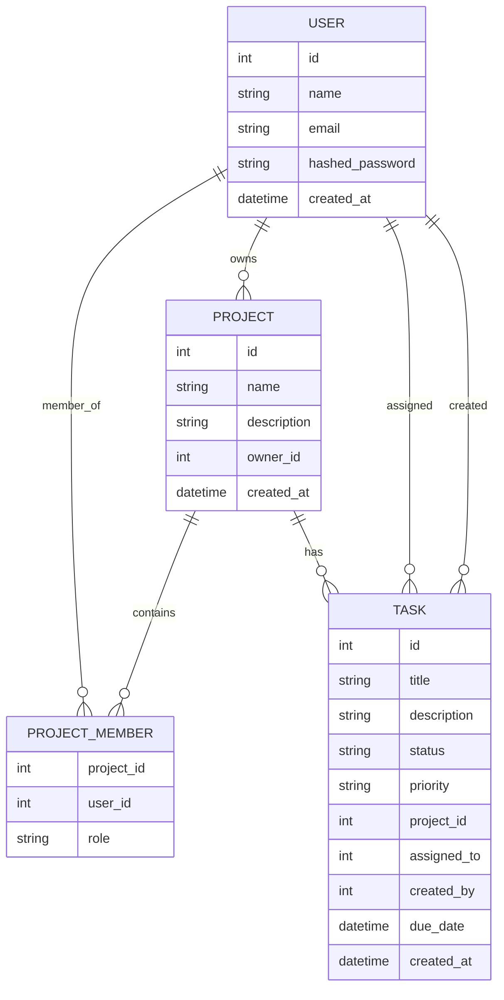

# Task Management API

A RESTful Task and Project Management API built using **FastAPI** and **PostgreSQL**.

The application supports secure JWT authentication, project and task management, role-based access control (RBAC), task assignment, filtering, pagination, validation, rate limiting, and automated testing.

This project demonstrates production-style backend architecture using SQLAlchemy ORM, Alembic migrations, and a layered application design.

---


## Features

### Authentication

- User Registration
- User Login
- JWT Authentication

### Projects

- CRUD Operations
- Membership Management
- Role-Based Access Control (RBAC)

### Tasks

- CRUD Operations
- Filtering
- Pagination
- Status Updates

### Security

- Request Validation
- Rate Limiting
- Error Handling

### Testing

- Pytest

---

## Tech Stack

| Category           | Technologies     |
| ------------------ | ---------------- |
| Language           | Python 3         |
| Backend Framework  | FastAPI          |
| Database           | PostgreSQL       |
| ORM                | SQLAlchemy       |
| Database Migration | Alembic          |
| Authentication     | JWT              |
| Password Hashing   | Passlib (bcrypt) |
| Data Validation    | Pydantic         |
| ASGI Server        | Uvicorn          |
| Testing            | Pytest           |

---

## Project Structure

```text
app
│
├── core
│   ├── __init__.py
│   ├── config.py
│   ├── database.py
│   └── security.py
│
├── crud
├── dependencies
├── models
├── routers
├── schemas
├── main.py
│
tests
│
alembic
│
requirements.txt
│
README.md
```

### Folder Overview

#### core

Contains the application's core configuration, database connection, JWT authentication, and password hashing utilities.

#### crud

Contains all database operations and business logic separated from API routes.

#### routers

Defines all API endpoints and handles incoming HTTP requests.

#### schemas

Contains Pydantic models used for request validation and API responses.

#### models

Contains SQLAlchemy ORM models that define the database schema.

#### dependencies

Contains reusable authentication and authorization dependencies such as `get_current_user` and role-based access control.

---

## Installation

### 1. Clone the repository

```bash
git clone https://github.com/adi-1110/Task-management-api.git
```

### 2. Navigate to the project directory

```bash
cd Task-management-api
```

### 3. Create a virtual environment

```bash
python -m venv venv
```

### 4. Activate the virtual environment

#### Windows

```bash
venv\Scripts\activate
```

#### Linux / macOS

```bash
source venv/bin/activate
```

### 5. Install project dependencies

```bash
pip install -r requirements.txt
```

---

## Environment Variables

Create a `.env` file in the project root directory and configure the following variables:

```env
DATABASE_URL=

SECRET_KEY=

ALGORITHM=HS256

ACCESS_TOKEN_EXPIRE_MINUTES=30
```

Replace these values with your PostgreSQL database URL and a secure JWT secret key before running the application.


---

## Database Migration

After configuring the environment variables, apply the database migrations using Alembic.

```bash
alembic upgrade head
```

This command creates all required database tables in the PostgreSQL database.

---

## Running the Application

Start the FastAPI development server:

```bash
uvicorn app.main:app --reload
```

The API will be available at:

```
http://localhost:8000
```

### API Documentation

Swagger UI

```
http://localhost:8000/docs
```

ReDoc

```
http://localhost:8000/redoc
```

---

## API Endpoints

### Authentication

| Method | Endpoint | Description |
|---------|----------|-------------|
| POST | `/auth/register` | Register a new user |
| POST | `/auth/login` | Authenticate user and receive JWT |

### Projects

| Method | Endpoint | Description |
|---------|----------|-------------|
| POST | `/projects` | Create a project |
| GET | `/projects` | Get all projects of the current user |
| GET | `/projects/{project_id}` | Get a specific project |
| PUT | `/projects/{project_id}` | Update a project |
| DELETE | `/projects/{project_id}` | Delete a project |
| POST | `/projects/{project_id}/members` | Add a member to a project |

### Tasks

| Method | Endpoint | Description |
|---------|----------|-------------|
| POST | `/projects/{project_id}/tasks` | Create a task |
| GET | `/projects/{project_id}/tasks` | Get project tasks |
| PUT | `/tasks/{task_id}` | Update a task |
| PATCH | `/tasks/{task_id}/status` | Update task status |
| DELETE | `/tasks/{task_id}` | Delete a task |

---

## Authentication Flow

The application uses JWT (JSON Web Token) authentication.

```
Client

↓

POST /auth/login

↓

Password Verification

↓

JWT Token Generation

↓

Authorization: Bearer <token>

↓

Protected Endpoint

↓

JWT Validation

↓

Response
```

### Authorization Header

```http
Authorization: Bearer <your_access_token>
```

Every protected endpoint validates the JWT before processing the request.

---

## Architecture Overview

The project follows a layered architecture to separate responsibilities and improve maintainability.

```
Client
   │
   ▼
API Router
   │
   ▼
Authentication & RBAC Dependencies
   │
   ▼
CRUD Layer
   │
   ▼
SQLAlchemy Models
   │
   ▼
PostgreSQL Database
```

### Layer Responsibilities

#### Routers

- Handle HTTP requests
- Validate incoming requests
- Return API responses

#### Dependencies

- Authenticate users
- Verify JWT tokens
- Enforce Role-Based Access Control (RBAC)

#### CRUD Layer

- Perform database operations
- Encapsulate business logic
- Keep route handlers clean

#### Models

- Define database tables
- Manage relationships
- Define constraints

#### Schemas

- Validate request payloads
- Serialize response data
- Prevent invalid input

---

## Role-Based Access Control (RBAC)

The API implements Role-Based Access Control using reusable FastAPI dependencies.

### Roles

### Admin

- Create projects
- Update projects
- Delete projects
- Add project members
- Delete any task in the project

### Member

- View assigned projects
- Create tasks
- Update tasks
- Change task status

Permissions are enforced through dependency injection rather than scattered conditional logic, improving code reusability and maintainability.

---
## Database Schema (ER Diagram)


## Example API Requests

### Register User

**POST**

```
/auth/register
```

Request

```json
{
    "name": "John Doe",
    "email": "john@example.com",
    "password": "password123"
}
```

Response

```json
{
    "id": 1,
    "name": "John Doe",
    "email": "john@example.com"
}
```

---

### Login

**POST**

```
/auth/login
```

Request

```json
{
    "username": "john@example.com",
    "password": "password123"
}
```

Response

```json
{
    "access_token": "<JWT_TOKEN>",
    "token_type": "bearer"
}
```

---

### Create Project

**POST**

```
/projects
```

Request

```json
{
    "name": "Task Management API",
    "description": "Backend project"
}
```

Response

```json
{
    "id": 1,
    "name": "Task Management API",
    "description": "Backend project"
}
```

---

### Create Task

**POST**

```
/projects/1/tasks
```

Request

```json
{
    "title": "Complete README",
    "description": "Prepare project documentation",
    "priority": "high"
}
```

Response

```json
{
    "id": 1,
    "title": "Complete README",
    "status": "todo",
    "priority": "high"
}
```

---

### Update Task Status

**PATCH**

```
/tasks/1/status
```

Request

```json
{
    "status": "done"
}
```

Response

```json
{
    "message": "Task status updated successfully"
}
```

---

## Testing

Run all tests using:

```bash
pytest -v
```

The test suite covers:

- User Registration
- User Login
- JWT Authentication
- Authorization
- RBAC
- Project Endpoints
- Task Endpoints
- Task Filtering
- Error Handling

---

## Future Improvements

Possible enhancements include:

- Task Comments
- File Attachments
- Email Notifications
- Activity Logs
- Audit Trail
- WebSocket Notifications
- Project Analytics Dashboard
- Search Functionality
- Docker Deployment
- CI/CD Pipeline with GitHub Actions

---
## Live Demo

API:
https://task-management-api-17y1.onrender.com

Swagger:
https://task-management-api-17y1.onrender.com/docs
## Author

**Aditya SP**

- GitHub: https://github.com/adi-1110
- LinkedIn: https://linkedin.com/in/aditya-sp2005

---
